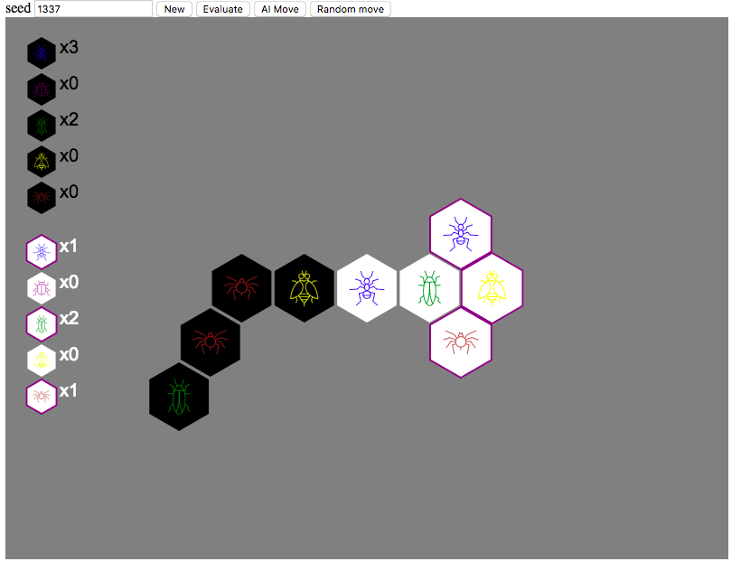

# Hive
Hive implementation in python. Check it out over at https://hive.now.sh/

Featuring hot graphics I bought over at iconfinder.com for $8.

Basic AI using minmax search.

_Current code in action. Very rudamentary UI._

## Running

    python -m venv venv
    source venv/bin/activate
    pip install -r requirements.txt
    ./run.sh

## Docker
Can be run inside a container. First build the image

    docker build --tag hive .

Then run the image in a container, for example like so

    docker run --rm --publish 8000:8000 hive

## Author
Samuel Carlsson
